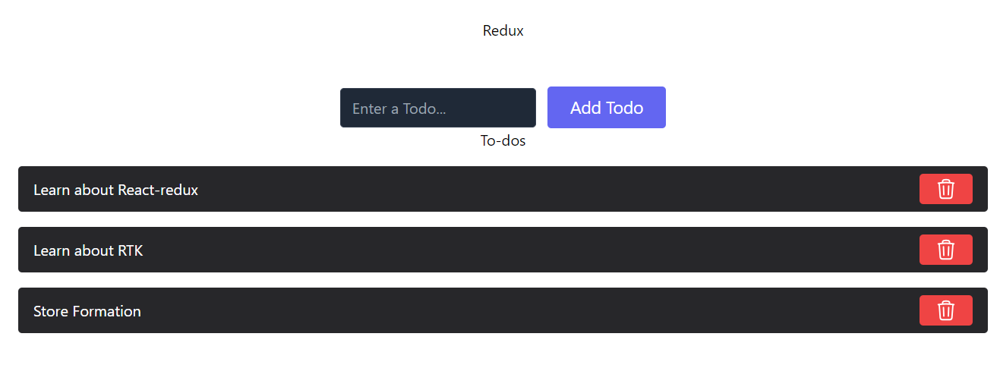

# React-Redux with Redux Toolkit
This project demonstrates how to effectively manage application state in a React application using Redux Toolkit and React-Redux.

### React-Redux

React-Redux provides a seamless integration between React components and the Redux store. It allows components to:

- **Access State:** Read data from the Redux store with the `useSelector` hook.
- **Dispatch Actions:** Trigger state updates by dispatching actions to the store using the `useDispatch` hook.

**Key Features:**

- `Provider`: Makes the Redux store accessible to all components within the application.
- `connect`: Connects React components to the Redux store, allowing them to access state and dispatch actions.

### Redux Toolkit

Redux Toolkit simplifies the creation and management of Redux logic. It offers a streamlined API that reduces boilerplate code and improves clarity.

**Key Features:**

- `createSlice`: Encapsulates state, actions, and reducers into a single unit.
- `configureStore`: Creates a Redux store with convenient middleware setup.
- `createAsyncThunk`: Simplifies handling asynchronous data loading actions.


## Setup redux-toolkit and react-redux 
```
npm install @reduxjs/toolkit
```

```
npm install react-redux
```

##  File Structure 
```
src/
  features/
    todo/
      todoSlice.js  // Defines initial state, actions, and reducers for todos
  App/
    Store.js      // Creates and configures the Redux store
  components/
    Todos.jsx       // Example component that interacts with the store
```

1. **Defining the initial state** :
- Creation of Slice, `src > features > todo > todoSlice.js`
_Slice is encapsulation of state, actions and reducers_

- Here, we define inital state of 'todos' slice 
- Then, inside slice we create reducers: addTodo and removeTodo which handle state based on dispatched actions and are then exported to store

2. **Configuration of Store**
- Creation of store, `src > App > Store.js`
    - Store imports reducers `todoReducers`

3. **Dispatch and Select**
- Using useDispatcher and useSelector inside the components 
- `useSelector(state => state.todos)` retrieves the todos slice from the state.
- `useDispatch()` allows you to dispatch actions to the store.

## Final :


official documentation for React-Redux and Redux Toolkit for deeper learning:

- [React-Redux](https://react-redux.js.org/) 
- [Redux Toolkit](https://redux-toolkit.js.org/)

#### React + Vite

This template provides a minimal setup to get React working in Vite with HMR and some ESLint rules.

Currently, two official plugins are available:

- [@vitejs/plugin-react](https://github.com/vitejs/vite-plugin-react/blob/main/packages/plugin-react/README.md) uses [Babel](https://babeljs.io/) for Fast Refresh
- [@vitejs/plugin-react-swc](https://github.com/vitejs/vite-plugin-react-swc) uses [SWC](https://swc.rs/) for Fast Refresh
